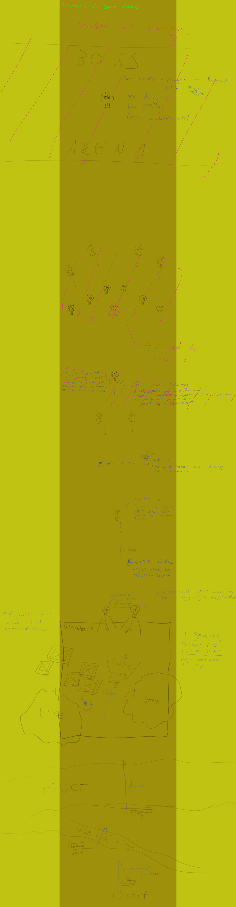

# Phurey: The Wild West Ninja
Phurey is a challenging 2D slasher/shooter inspired by Furi and many other games.

A game made for the subject Game Design.\
[Play it here!](https://technicjelle.github.io/Phurey/)

This game was made in JavaScript using the [p5.js framework](https://p5js.org/), [p5.play library](https://molleindustria.github.io/p5.play/), [p5 SceneManager](https://mveteanu.github.io/p5.SceneManager/) and [HTML5 Javascript Gamepad Controller Library](https://kallaspriit.github.io/HTML5-JavaScript-Gamepad-Controller-Library/).

I am never making anything approaching or exceeding this scale in JavaScript ever again. This was not a fun developing experience.\
Almost *2k lines* of suffering.

**The following document is the Game Design Document that describes the game I had originally planned to make. Due to time, effort and programming language constraints, I had to scope down quite a bit for the final game.**

## 1. Game overview
Link to the game: https://technicjelle.github.io/Phurey/

### 1.1 Summary
Phurey is a top-down game about shooting, slashing, dashing and deflecting. It features three levels, where the first two levels each have their own game mechanic, while the third level combines both of them as the final challenge.

### 1.2 Game concept
You play as a ninja (with a katana, of course) in the Wild West.
You see a wanted poster of a group of three bandits: 
    Wanted Dead or Alive. (← capture)
The first bandit always fights with a dagger and lasso. (Like the Mara fight in Ghostrunner)
The second bandit always uses his gun (bullet hell)
The third bandit uses a dagger and a gun, combining the challenges of the first two bosses into one even more challenging boss.

In the levels are also just general goons that you have to fight and get past. They start off weak at the beginning of the level, so that you can get used to the controls, and both you and the enemies gradually get better and better until finally your skill gets tested at the level’s boss.

You start off in the first level with only your katana, and the player has to learn how to dash, slash and deflect.
There are two ways of deflecting: holding the deflect button makes you hold up your sword in front of you, and then you deflect the next incoming projectile in some random direction. (Deflect) There is a cooldown of a few milliseconds before you can start blocking again.
You can also press the deflect button at the exact right time and instead of in a random direction, the projectile is shot back at the shooter. (Reflect/Parry) The cooldown here is less than the other deflect cooldown.

After you capture the first boss, you pick up his gun.

In the second level, the player learns how to shoot. I want to dissuade the player from slashing in this level. I’m thinking of using thorns or shields, or maybe something else entirely.
There are some weak goons here again, and they get better and better the farther along the level you are.

The second boss fight is a bullet hell. The boss has stages where he can’t be hit by your bullets, and you have to wait until the phase is over till you can shoot to damage him again. Extremely skilful players can get close enough to be able to use their swords too.

After you defeat the second boss by showing off your mastery of dashing, shooting and deflecting, the third boss appears immediately afterwards and all your skills (slashing, dashing, shooting and deflecting) are tested thoroughly.
The third boss-fight starts off with a bit of melee combat, after which Boss runs away and a chase scene where the bullet hell aspect of the game ramps up again. If you’ve done enough damage, the boss fight is done, and you can calmly deliver the last slash, which is more cinematic.

### 1.3 Genre
The main parts of the game, the boss fights, will be a bullet hell, like Furi, Nova Drift and Touhou.
The other parts are more simple.
Skills required are quick reflexes and a drive to improve oneself.

### 1.4 Targets

##### Target Audience(s):
Ages: 13+\
Focus groups:
- Indie Game Fans
- Bullet hell shoot 'em up fans

Player types:
- Achiever
- Killer

##### Target Hardware
Platform(s): Desktop Firefox

#### 1.4.1 User input
| **Mouse & Keyboard** | |
| --- | --- |
Movement ❇:|WASD / IJKL / Arrow Keys
Dash:|Space / Shift (Left or Right)
Aiming:|Point with the Mouse
Slashing:|Left Click [in direction of cursor]
Reflect/Parry:|Left Click (Projectile is near) [in direction of cursor]
Block:|Left Click (Hold) [in direction of cursor]
Shooting:|Right Click [in direction of cursor]

| **Most Gamepads** | (Firefox-exclusive feature*)|
| --- | --- |
Movement:|Left Stick
Dash:|A / ✕ / Left Trigger / Left Bumper
Aiming & Shooting:|Right Stick
Slashing:|X / ☐  [in direction of last movement]
Reflect/Parry:|B / ◯ [in direction of last movement]
Block:|B / ◯ (Hold) [in direction of last movement]

*\* Only Firefox, because Chromium-based browsers have a bug in them where they reconnect the gamepad every time an input is given, so half of the buttons you press aren’t registered.*

### 1.5 Setting 
The main character Phurey (ふれい / フレイ) is a ninja in a classic Wild West setting.
Antagonists: Dryack the Daggerer, Gus the Gunner, Boss

### 1.6 Look and feel
Three wanted posters, ranking up in money.

In-game character sprites would be like this (only then, of course, ninja, and wild west style):\
https://opengameart.org/content/animated-top-down-survivor-player

Enemy boss character designs:\
Dryack the Daggerer: https://napo-4v.artstation.com/projects/VeRVb \
Gus the Gunner: https://napo-4v.artstation.com/projects/aXANz \
Boss: https://opengameart.org/content/pixel-art-comboys-robot-cowboy

Some tile maps:\
https://opengameart.org/content/cowboy-game-sprites \
https://opengameart.org/content/master-system-western \
https://graphicriver.net/item/barren-land-top-down-tileset/14391117 \
https://us.degicashop.com/products/wild-west-tiles-pack

As soundtrack, kind of a mix between this:\
[Western Music - Vindsvept - One step too far](https://www.youtube.com/watch?v=w5q0bQigntU)\
[Serenity - Japanese/Fantasy Music](https://www.youtube.com/watch?v=t8MC135MwdE)\
[Fantasy/Far East Music - Vindsvept - The Story So Far](https://www.youtube.com/watch?v=orvLhmoRLUQ)\
but a little more high-action.

### 1.7 Game flow
The player moves around using their preferred method of input and slashes enemies when they get near. They dash around to outmanoeuvre the enemies to deliver extra skilful blows.
If the player is show at, they can block and deflect the bullet, or they can reflect the bullet back to the enemy that shot it.
While defeating these enemies, the player slowly makes their way to the top of the level, where the aforementioned boss fights take place.

## 2. Gameplay

### 2.1 Mechanics
The player can move around.
The player can dash quickly by tapping the dash button, but they can also hold down the dash button to charge up a longer dash (they will have slower movement while charging the dash).
The player can swing their sword by clicking the mouse or using the controller button. If they click using the mouse, the sword is swung into the direction of the cursor, but if they’re using a controller, the sword is swung in the direction the player is currently moving in.
The player can use their sword to defeat enemies in one hit. They can also swing at just the right moment to reflect a bullet back to the original sender. If the player holds the sword button, they go into block mode, which will deflect the first bullet that hits the sword (the block does not cover 360 degrees of the player, but only a slice of that). The blockade can be aimed using the mouse or by moving if the player is using a controller.
The player can also shoot their gun after the first boss, which is done by either right-clicking, or by using the right stick on their controller.

### 2.2 Flow and progression
The player’s ultimate goal is to catch all the bandits, which they do by defeating them one by one in every level. The reward is the fact that they completed the game, which is a challenge, as this is a challenging game. This caters to the Killers and Achievers player types.
Throughout every level, there is a smaller goal, namely defeating the boss of that level.

### 2.3 Structure, pacing and Level Design
The game starts off with a cutscene that explains why there is a ninja in the wild west, and then proceeds to show the Phurey seeing the wanted poster.
The game begins.
The first two levels start off with the calm introduction of the new game mechanic, in the middle the player is challenged more and more into mastering the mechanic. The boss fights at the end of the level are as a final test of the player’s newfound skills.
The final boss fight is therefore the ultimate test of the player’s skills, where they have to show off everything they have learnt in the entire game.

**Level 1 concept (start from the bottom and go up):**

The next level would be laid out in a similar style.

The boss fights are always in a locked off arena (if the player dies during a boss fight, they restart the fight, not the entire level)
The first boss fight is a pretty small square arena, but the second is a slightly bigger round one where the boss mostly stays in the middle and shoots around himself, while the player has to dodge the bullets and shoot back in the correct phases.
The third boss fight starts off like the first one, only a bit more difficult, and in the second phase, the chase, the arena expands upwards, and the player has to chase the boss while he flees and shoots back. This chase might lead to and through the small town the bandits had been terrorizing, while the first two levels took place in the bandits’ camp.

## 3 Assets
Here are all the assets I used. They would all be replaced in the final product by artists and designers: https://github.com/TechnicJelle/Phurey/tree/main/assets
There are credit.txt files with links to the places I got the textures from.
I also drew a few myself.

